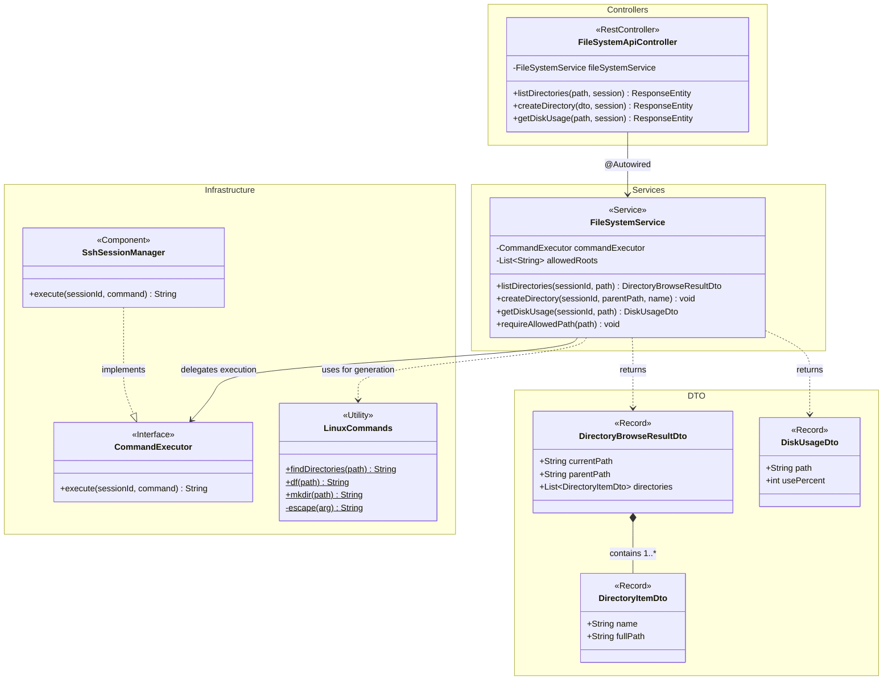
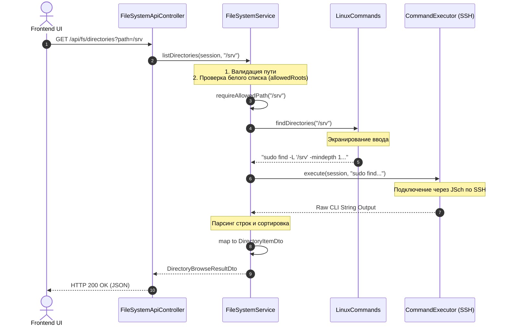

# Архитектура приложения (Backend)

В данном документе описана слоистая архитектура (Layered/Clean Architecture) бэкенда на примере модуля файловой системы (`FileSystemService`). Этот же паттерн применяется ко всем остальным модулям (конфигурация Samba, пользователи, группы, логи).

## 1. Диаграмма классов (Class Diagram)

Схема ниже отображает взаимодействие слоев: от REST-контроллера через бизнес-логику к исполнителю инфраструктурных команд и формируемым DTO (Data Transfer Objects).

### Пояснения к слоям:
1. **Controller Layer (Контроллеры)**: Тонкий слой (`FileSystemApiController`). Отвечает за прием HTTP-запросов, извлечение токенов/сессий, базовую валидацию `@Valid` и возврат клиенту форматированных JSON-ответов (`ResponseEntity`).
2. **Service Layer (Логика)**: Ядро приложения (`FileSystemService`). Здесь реализуется бизнес-логика: проверка макро-прав (whitelist путей `requireAllowedPath`), парсинг вывода системных утилит, форматирование байтов и оборачивание результата в Immutable-рекорды (Record DTO).
3. **Infrastructure Layer (Инфраструктура)**: Абстракция исполнения команд. Бизнес-логика не работает с SSH-клиентом напрямую, а зависит от интерфейса `CommandExecutor`. Разрешение зависимостей и конкретная реализация (`SshSessionManager`) инжектится во время выполнения контейнером Spring Boot.
4. **Security Utils / Builders (`LinuxCommands`)**: Защищенная изолированная песочница для формирования команд с обязательным экранированием(`escape()`) и защитой от Shell Injection и Path Traversal.

---

## 2. Диаграмма последовательности (Sequence Diagram)

Поток выполнения типового запроса (например, «Получить список папок»).

### Ключевые паттерны проектирования:
* **Dependency Injection & Inversion of Control (IoC):** Внедрение зависимостей через единый канонический конструктор (Service -> Interface).
* **Defense-in-depth (Глубокая защита):** Валидация на уровне контроллера + проверка прав и белого списка файловых путей в UI-сервисе + строк-экранирование в Command Builder.
* **DTO Pattern (Record):** Неизменяемые Data Transfer Objects для защиты от мутаций контрактов фронтенда (иммутабельность в Java 17+ Records). 