# Полная Диаграмма Классов Backend-приложения (samba-web-ui)

Данный документ содержит детальную, сквозную архитектурную кросс-схему (UML Class Diagram) Java Spring Boot бэкенда для проекта `samba-web-ui`.

## Легенда UML связей (Mermaid нотация)
* `..|>` - **Реализация (Realization)**: класс реализует интерфейс.
* `--|>` - **Наследование (Inheritance)**: класс наследует родительский класс.
* `*--` - **Композиция (Composition)**: жесткое владение (например, DTO-контейнер содержит список DTO-объектов).
* `o--` - **Агрегация / Внедрение зависимостей (Aggregation / DI)**: сервисы и компоненты, внедряемые через конструктор (например, `@Service` содержит `CommandExecutor`).
* `-->` - **Ассоциация (Association)**: использование вспомогательного утилитного класса.
* `..>` - **Зависимость (Dependency)**: использование в качестве типа возвращаемого значения или аргумента в методе.

---

```mermaid
classDiagram

    %% ==========================================
    %% NAMESPACES (Packages)
    %% ==========================================

    namespace config {
        class SambaProperties
        class SecurityConfig
        class WebMvcConfig
    }

    namespace exception {
        class SambaCommandException
        class SshSessionExpiredException
        class GlobalExceptionHandler
    }

    namespace controller {
        class AdApiController
        class AuthApiController
        class ConfigApiController
        class FileSystemApiController
        class GroupApiController
        class LogApiController
        class MonitoringApiController
        class ShareApiController
        class UserApiController
    }

    namespace service {
        class AuthService
        class AuthServiceImpl
        class BruteForceProtectionService
        class BruteForceProtectionServiceImpl
        class FileSystemService
        class SambaConfigService
        class SambaGroupService
        class SambaLogService
        class SambaMonitoringService
        class SambaShareService
        class SambaUserService
        class AdIntegrationService
    }

    namespace infra {
        class CommandExecutor
        class SshSessionManager
        class LinuxCommands
        class SmbConfParser
        class CommandResult
    }

    namespace model {
        class SambaGroup
        class SambaShare
        class SambaUser
    }

    namespace dto {
        class ApiResponse~T~
        class AdJoinRequestDto
        class AdStatusDto
        class ConnectionRequestDto
        class SambaBackupDto
        class SambaGlobalConfigDto
        class SambaRawConfigDto
        class CreateDirectoryDto
        class DirectoryBrowseResultDto
        class DirectoryItemDto
        class DiskUsageDto
        class SambaGroupAddUserDto
        class SambaGroupCreateDto
        class SambaShareCreateDto
        class SambaUserChangePasswordDto
        class SambaUserCreateDto
    }

    %% ==========================================
    %% CLASSES & INTERFACES DETAILS
    %% ==========================================

    %% MAIN
    class SambaWebUiApplication {
        <<BootApplication>>
        +main(args) void
    }

    %% CONFIGURATION
    class SambaProperties {
        <<ConfigurationProperties>>
        +Security security()
    }
    class SecurityConfig {
        <<Configuration>>
        +securityFilterChain(http) SecurityFilterChain
        +corsConfigurationSource() CorsConfigurationSource
    }
    class WebMvcConfig {
        <<Configuration>>
        +addCorsMappings(registry) void
    }

    %% EXCEPTIONS & ADVICE
    class SambaCommandException {
        <<Exception>>
        -int exitCode
        -String output
        -String error
    }
    class SshSessionExpiredException {
        <<Exception>>
    }
    class GlobalExceptionHandler {
        <<RestControllerAdvice>>
        +handleSambaCommandException(e) ResponseEntity
        +handleIllegalArgumentException(e) ResponseEntity
        +handleGeneralException(e) ResponseEntity
        +handleSshSessionExpiredException(e) ResponseEntity
    }

    %% INFRASTRUCTURE
    class CommandExecutor {
        <<Interface>>
        +execute(sessionId, command) String
        +execute(sessionId, command, input) String
        +executeCommand(sessionId, command) CommandResult
        +executeCommand(sessionId, command, input) CommandResult
    }
    class SshSessionManager {
        <<Component>>
        -Map~String, SshSession~ sessions
        -SambaProperties properties
        +SshSessionManager(properties)
        +execute(sessionId, command) String
        +executeCommand(sessionId, command) CommandResult
    }
    class LinuxCommands {
        <<Utility>>
        +escape(arg)$ String
        +cat(path)$ String
        +mkdir(path)$ String
        +findDirectories(path)$ String
        +df(path)$ String
        +smbstatus(flag)$ String
        +netAdsJoin(u, p)$ String
    }
    class SmbConfParser {
        <<Component>>
        +parseShares(configContent) List~SambaShare~
        +parseGlobal(configContent) SambaGlobalConfigDto
        +updateShare(config, share) String
    }
    class CommandResult {
        <<Record>>
        +int exitCode
        +String output
        +String error
    }

    %% SERVICES
    class AuthService {
        <<Interface>>
        +login(host, port, username, password) String
        +logout(sessionId) void
        +isAuthenticated(sessionId) boolean
        +validateSession(sessionId) void
    }
    class AuthServiceImpl {
        <<Service>>
        -SshSessionManager sshSessionManager
        -BruteForceProtectionService bruteForceProtection
        +login(...) String
    }
    class BruteForceProtectionService {
        <<Interface>>
        +recordLoginAttempt(ip) void
        +recordLoginSuccess(ip) void
        +isBlocked(ip) boolean
    }
    class BruteForceProtectionServiceImpl {
        <<Service>>
        -Map~String, LoginAttemptInfo~ attempts
        -SambaProperties properties
    }
    class FileSystemService {
        <<Service>>
        -CommandExecutor commandExecutor
        -List~String~ allowedRoots
        +FileSystemService(executor, properties)
        +listDirectories(sessionId, path) DirectoryBrowseResultDto
        +createDirectory(sessionId, parentPath, name) void
        +getDiskUsage(sessionId, path) DiskUsageDto
    }
    class SambaConfigService {
        <<Service>>
        -CommandExecutor commandExecutor
        -SmbConfParser parser
        -SambaProperties properties
        +getGlobalConfig(sessionId) SambaGlobalConfigDto
        +getRawConfig(sessionId) String
        +createBackup(sessionId) SambaBackupDto
        +listBackups(sessionId) List~SambaBackupDto~
        +restoreBackup(sessionId, filename) void
    }
    class SambaGroupService {
        <<Service>>
        -CommandExecutor commandExecutor
        +SambaGroupService(executor, properties)
        +listGroups(sessionId) List~SambaGroup~
        +getGroup(sessionId, groupName) SambaGroup
        +createGroup(sessionId, createDto) SambaGroup
        +deleteGroup(sessionId, groupName) void
        +addUserToGroup(sessionId, groupName, username) void
        +removeUserFromGroup(sessionId, groupName, username) void
    }
    class SambaLogService {
        <<Service>>
        -CommandExecutor commandExecutor
        +getRecentLogs(sessionId, lines) String
    }
    class SambaMonitoringService {
        <<Service>>
        -CommandExecutor commandExecutor
        +getActiveConnections(sessionId) String
        +getLockedFiles(sessionId) String
        +isSmbdActive(sessionId) boolean
        +restartSmbd(sessionId) void
        +killSession(sessionId, pid) void
    }
    class SambaShareService {
        <<Service>>
        -SambaConfigService configService
        -CommandExecutor commandExecutor
        +listShares(sessionId) List~SambaShare~
        +createShare(sessionId, createDto) SambaShare
        +updateShare(sessionId, name, share) SambaShare
        +deleteShare(sessionId, name) void
    }
    class SambaUserService {
        <<Service>>
        -CommandExecutor commandExecutor
        +listUsers(sessionId) List~SambaUser~
        +createUser(sessionId, createUserDto) SambaUser
        +deleteUser(sessionId, username) void
        +changePassword(sessionId, username, dto) void
    }
    class AdIntegrationService {
        <<Service>>
        -CommandExecutor commandExecutor
        +joinDomain(sessionId, req) AdStatusDto
        +leaveDomain(sessionId, req) void
        +checkStatus(sessionId) AdStatusDto
    }

    %% CONTROLLERS
    class AdApiController {
        <<RestController>>
        -AdIntegrationService adIntegrationService
    }
    class AuthApiController {
        <<RestController>>
        -AuthService authService
    }
    class ConfigApiController {
        <<RestController>>
        -SambaConfigService configService
    }
    class FileSystemApiController {
        <<RestController>>
        -FileSystemService fileSystemService
    }
    class GroupApiController {
        <<RestController>>
        -SambaGroupService groupService
    }
    class LogApiController {
        <<RestController>>
        -SambaLogService logService
    }
    class MonitoringApiController {
        <<RestController>>
        -SambaMonitoringService monitoringService
    }
    class ShareApiController {
        <<RestController>>
        -SambaShareService shareService
    }
    class UserApiController {
        <<RestController>>
        -SambaUserService userService
    }

    %% ==========================================
    %% RELATIONSHIPS (Architecture Routing)
    %% ==========================================

    %% Interfaces and Implementations
    AuthServiceImpl ..|> AuthService
    BruteForceProtectionServiceImpl ..|> BruteForceProtectionService
    SshSessionManager ..|> CommandExecutor

    %% Dependency Injection: Controllers -> Services
    AdApiController o-- AdIntegrationService
    AuthApiController o-- AuthService
    ConfigApiController o-- SambaConfigService
    FileSystemApiController o-- FileSystemService
    GroupApiController o-- SambaGroupService
    LogApiController o-- SambaLogService
    MonitoringApiController o-- SambaMonitoringService
    ShareApiController o-- SambaShareService
    UserApiController o-- SambaUserService

    %% Dependency Injection: Services -> Infra (CommandExecutor)
    AuthServiceImpl o-- SshSessionManager
    AuthServiceImpl o-- BruteForceProtectionService
    AdIntegrationService o-- CommandExecutor
    FileSystemService o-- CommandExecutor
    SambaConfigService o-- CommandExecutor
    SambaConfigService o-- SmbConfParser
    SambaGroupService o-- CommandExecutor
    SambaLogService o-- CommandExecutor
    SambaMonitoringService o-- CommandExecutor
    SambaShareService o-- SambaConfigService
    SambaShareService o-- CommandExecutor
    SambaUserService o-- CommandExecutor

    %% Advice & Global Handlers (Dependencies)
    GlobalExceptionHandler ..> ApiResponse~T~ : wraps outputs

    %% Utility Composition & Associations
    AdIntegrationService --> LinuxCommands : generates commands
    FileSystemService --> LinuxCommands : generates commands
    SambaConfigService --> LinuxCommands : generates commands
    SambaGroupService --> LinuxCommands : generates commands
    SambaLogService --> LinuxCommands : generates commands
    SambaMonitoringService --> LinuxCommands : generates commands
    SambaShareService --> LinuxCommands : generates commands
    SambaUserService --> LinuxCommands : generates commands

    SambaConfigService ..> SambaGlobalConfigDto : returns
    SambaConfigService ..> SambaBackupDto : returns
    SambaShareService ..> SambaShare : returns
    SambaUserService ..> SambaUser : returns
    SambaGroupService ..> SambaGroup : returns

    %% DTO Dependencies / Composition
    DirectoryBrowseResultDto *-- DirectoryItemDto : contains 1..*
    FileSystemService ..> DirectoryBrowseResultDto
    FileSystemService ..> DiskUsageDto
    FileSystemService ..> CreateDirectoryDto : consumes
    
    AdIntegrationService ..> AdJoinRequestDto : consumes
    AdIntegrationService ..> AdStatusDto : returns

    SambaUserService ..> SambaUserCreateDto : consumes
    SambaUserService ..> SambaUserChangePasswordDto : consumes
    SambaGroupService ..> SambaGroupCreateDto : consumes
    SambaGroupService ..> SambaGroupAddUserDto : consumes

    SambaShareService ..> SambaShareCreateDto : consumes

    CommandExecutor ..> CommandResult : returns
    SambaProperties *-- SecurityConfig : used by
```

## Аналитический отчет об Архитектуре (Architecture Review)

На основе построенной UML-модели, можно выделить следующие объективные характеристики текущей архитектуры (Clean Architecture / Layered Design):

1. **Единый контур исполнения (`CommandExecutor`)**
   Все бизнес-сервисы зависят исключительно от интерфейса `CommandExecutor`, а не от конкретного протокола связи (SSH). Реализация `SshSessionManager` скрыта на уровне внедрения зависимостей. Это обеспечивает 100% тестопригодность и низкую связность (Low Coupling) — сервисы можно тестировать, просто замокав интерфейс, что реализовано во всем наборе юнит-тестов (`Mockito.mock(CommandExecutor.class)`).

2. **Защитная песочница (`LinuxCommands`)**
   Широкая сеть связей (Ассоциация `-->`) от каждого сервиса к утилитарному классу `LinuxCommands` выступает в качестве "бутылочного горлышка" для безопасности. Абсолютно все Shell-команды формируются только тут, где происходит обязательное экранирование кавычек (`escape`), проверка через регулярные выражения и защита от внедрений (`Systemd injection`, `Path Traversal`).

3. **Слабая связанность (Decoupled Data)**
   Слой REST-контроллеров и сервисы общаются исключительно через DTO (Data Transfer Objects — Java Records), а не напрямую через "живые" сущности базы данных или мутабельные бины. Входящие DTO используются строго на прием, исходящие — строго на возврат. Это предотвращает "утечку" инфраструктурных деталей во внешний фронтенд-API. Модель композиции DTO (например, `DirectoryBrowseResultDto *-- DirectoryItemDto`) также повышает изолированность и иммутабельность.

4. **Анализ зависимостей (Циклы и Coupling)**
   - **Циклические зависимости (Circular Dependencies) отсутствуют**. Архитектура имеет строгую древовидную форму `Controller -> Service -> Infra`. Ни один сервис не ссылается обратно на контроллер, ни один компонент инфраструктуры не знает о бизнес-логике.
   - **Узкое место композиции сервисов:** `SambaShareService` использует внутри себя `SambaConfigService` (DI/Агрегация: `SambaShareService o-- SambaConfigService`). Это единственный пример перекрёстного использования сервисов в домене. Такая связь оправдана (Share-директивы хранятся в общем конфиге `smb.conf`, и для их сохранения или чтения парсер пропускается через сервис конфига), но требует осторожности при дальнейшем расширении, чтобы не создать цикличность.

5. **Высокая когезия (High Cohesion)**
   Разделение по `namespace` (пакетам) подчеркивает строгую доменность. Пользователи работают в `UserApiController` -> `SambaUserService`, группы — в `GroupApiController` -> `SambaGroupService`. Нет "божественных" (`God Objects`) сервисов, каждый класс имеет единственную фокусную обязанность (Single Responsibility Principle). 